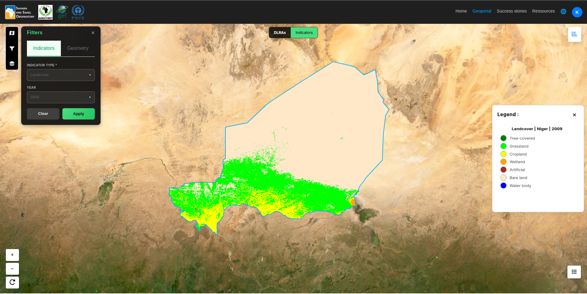
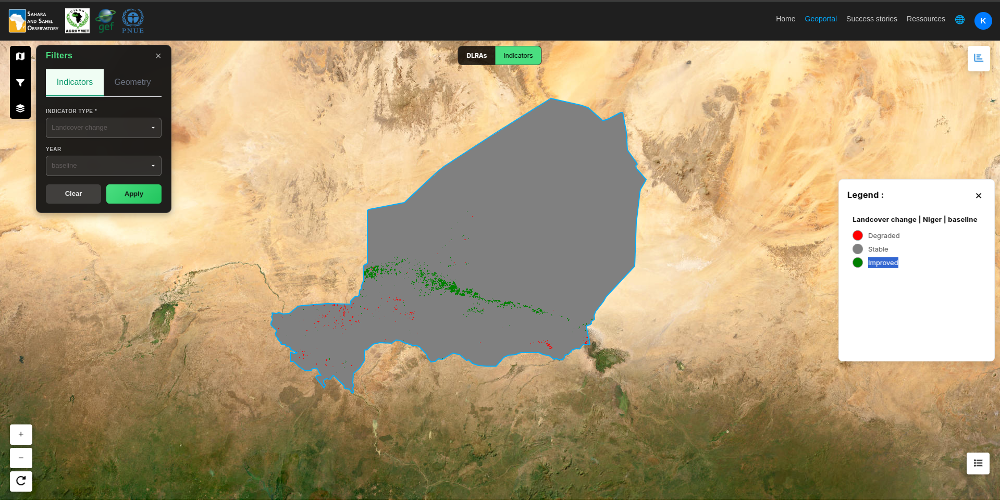
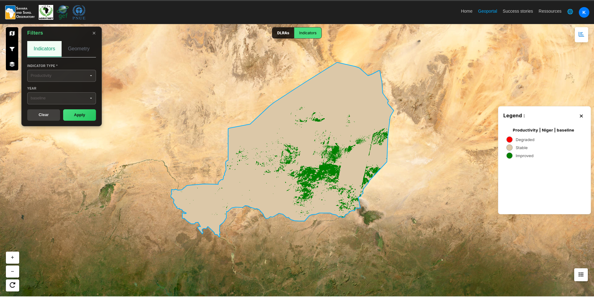
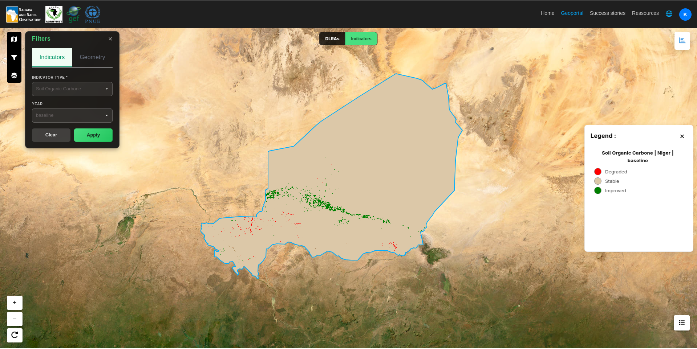
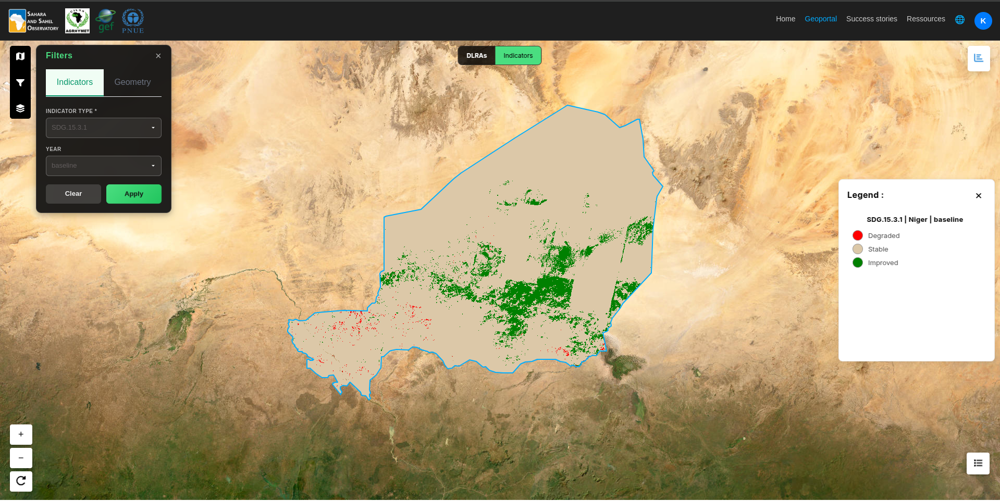

.. _sdg-15-3-1:

SDG 15.3.1
========================================

The Sustainable Development Goal (SDG) 15.3 aims to **combat desertification** and **restore degraded land and soil**, striving to achieve a **land degradation–neutral world by 2030**.

Indicator **15.3.1** measures the **proportion of degraded land** over the total land area, using three key sub-indicators:

.. contents::
   :local:
   :depth: 2

---

.. _land-cover:

Land Cover
----------------------

   Land cover map for Niger (2009)

The land cover sub-indicator measures changes in the Earth’s surface cover over time, detecting conversions between natural and human-modified land types.

**Typical data sources:**
- ESA CCI Land Cover

`Back to top <#sdg-15-3-1>`_

---

.. _land-cover-change:

Land Cover Change
----------------------

   Land cover map for Niger – baseline period (2000–2015)

This sub-indicator assesses **changes in land cover** between two reference periods (e.g., 2000–2015 or 2015–2022).  
It helps detect transitions between land-cover classes (forest, cropland, grassland, built-up areas, etc.) and quantify **losses or gains of natural land**.

**Typical data sources:**
- ESA CCI Land Cover

`Back to top <#sdg-15-3-1>`_

---

.. _land-productivity:

Land Productivity
----------------------

This sub-indicator analyzes **vegetation dynamics** (e.g., NDVI or EVI) to estimate **productivity trends**.  
A persistent decline in vegetation productivity can indicate **ecological degradation** or **human-induced land stress**.

**Common methods:**
- NDVI trend analysis (Mann-Kendall, Theil-Sen)
- Deviation from potential productivity
- Land productivity state classification

**Data sources:**
- MODIS NDVI/EVI
- Landsat NDVI
- Google Earth Engine analyses

`Back to top <#sdg-15-3-1>`_

---

.. _carbon-stock:

Carbon Stock
----------------

The **carbon stock** sub-indicator evaluates changes in **soil and biomass organic carbon**.  
Decreases in carbon storage often indicate **loss of organic matter**, **deforestation**, or **soil degradation**.

**Components considered:**
- Soil Organic Carbon (SOC)
- Above- and below-ground biomass carbon
- Total change between two time periods

**Data sources:**
- FAO GSOCmap
- GlobBiomass
- ESA CCI Biomass

`Back to top <#sdg-15-3-1>`_

---

Final SDG 15.3.1 Indicator
-------------------------

The **SDG indicator 15.3.1** measures the **proportion of degraded land** over the total land area.

Land is classified as **degraded** when **at least one** of the following sub-indicators shows a negative change:
- Land cover change
- Land productivity decline
- Carbon stock loss

This follows the **“one-out, all-out”** principle recommended by the **UNCCD**.
