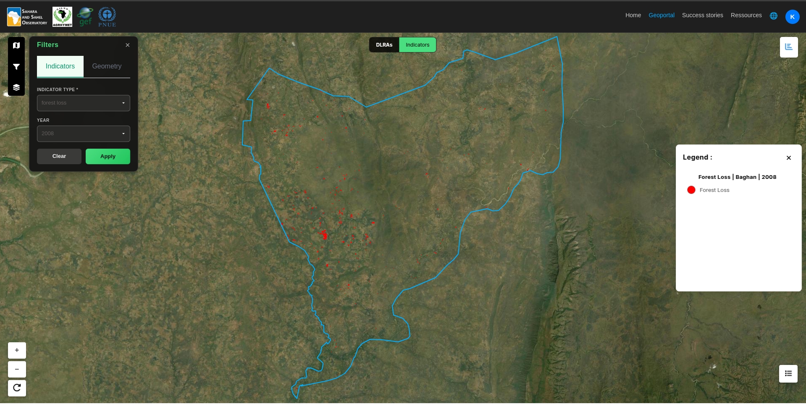

Forest Loss
========================================

.. toctree::
   :maxdepth: 1
   :caption: Navigation

   sdg_15_3_1
   land_cover
   land_cover_change
   land_productivity
   carbon_stock
   forest_loss

---

This page describes the **annual forest loss** derived from the **Hansen Global Forest Change** dataset.  
Forest loss represents the **stand-replacement disturbance** or complete removal of tree cover canopy at the pixel level for a given year.

The analysis is performed for a **specific area of interest (AOI)** and a **selected year**.

.. contents::
   :local:
   :depth: 2

---

Definition
----------------------

**Forest loss** is defined as the **complete removal of tree canopy cover** within a pixel, occurring in a specific year.  
Once a pixel is marked as forest loss, it remains classified as lost in subsequent years.

This indicator captures:
- Deforestation
- Severe logging
- Fire-induced canopy removal
- Conversion to non-forest land use

Forest loss does **not** distinguish between natural and human-induced causes.

---

Dataset
----------------------

The forest loss data is derived from:

**UMD / Hansen Global Forest Change**  
``UMD/hansen/global_forest_change_2024_v1_12``

**Key characteristics:**
- Spatial resolution: 30 m
- Temporal coverage: 2001–2023
- Global coverage
- Annual loss layer (``lossyear``)

---

Forest loss
----------------------

**Outputs include:**
- Annual forest loss map
- Total forest loss area for the selected year
- Spatial distribution of loss within the AOI

---