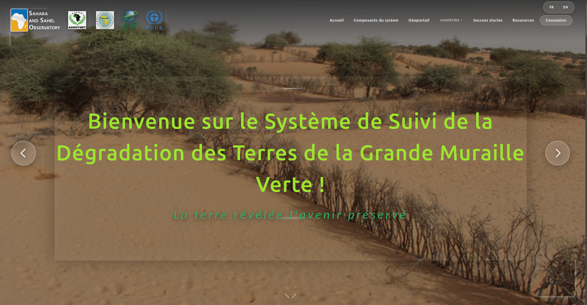
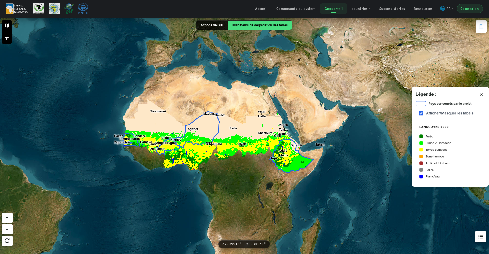

Introduction
============

   Page d'accueil de la plateforme GGW-LDM

La plateforme régionale de suivi de la dégradation des terres et de la gestion durable des terres (GDT) est développée dans le cadre du projet GEF-9825, mis en œuvre par le PNUE avec l'appui du FEM et coordonné par l'Observatoire du Sahara et du Sahel (OSS).

Elle vise à appuyer les pays de la Grande Muraille Verte (Burkina Faso, Éthiopie, Niger et Sénégal) dans le suivi, l'analyse et la diffusion des informations sur la dégradation des terres et les pratiques de GDT.

Hébergée par l'OSS, la plateforme permet de centraliser les données, visualiser les tendances, et faciliter la planification et la prise de décision en matière de restauration des terres.

Caractéristiques principales
-----------------------------

* Calcul d'indicateurs environnementaux (ODD 15.3.1, couverture terrestre, productivité, carbone organique des sols)
* Accès à diverses sources de données satellitaires et terrain
* Outils de cartographie avancés intégrant Google Earth Engine
* Interface utilisateur intuitive, bilingue français/anglais
* Téléchargement de rasters GeoTIFF et export de cartes

Interface générale
------------------

   Vue générale de l'interface du géoportail

Visitez la plateforme
---------------------

Pour plus d'informations, veuillez consulter notre site web :

https://ggw-ldn.oss-online.org/
