.. _geoportal-user-guide:

####################
Geoportal User Guide
####################

This guide explains the main features of the Geoportal interface and how to interact with the map, layers, and analytical tools.

.. contents::
   :local:
   :depth: 2

---

.. _geoportal-overview-interface:

Geoportal Overview Interface
============================

.. figure:: _static/images/geoportail_interface.png
   :alt: Geoportal interface overview
   :width: 700px
   :align: center

   Overview of the Geoportal interface

When you open the Geoportal, you will see the main map view, toolbar, and side panels for data and analysis.
This layout allows easy navigation and quick access to both datasets and analytical tools.

`Back to top <#geoportal-user-guide>`_

---

.. _use_legend:

Use the Legend
==============

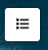

   Opening and understanding the legend

The legend explains the meaning of colors and symbols on the map,
helping you interpret the spatial data correctly.

`Back to top <#geoportal-user-guide>`_

---

.. _view_statistics:

View Statistics
===============

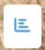

   Viewing map statistics

The statistics panel displays charts and numerical summaries for the selected area or indicator.

`Back to top <#geoportal-user-guide>`_

---

.. _zoom_controls:

Zoom Controls
=============

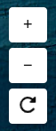

   Zooming in and out

Use the zoom buttons or mouse wheel to explore specific regions of the map more closely.

`Back to top <#geoportal-user-guide>`_

---

.. _change_base_map:

Change the Base Map
===================

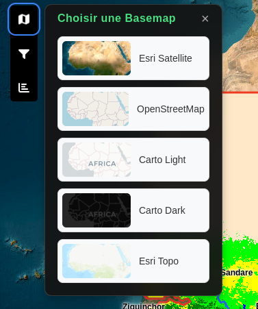

   Changing the base map

Users can switch between different base maps (e.g., satellite, topographic, street view)
to visualize spatial information according to their preference.
The base map selector is located on the right side of the toolbar.

`Back to top <#geoportal-user-guide>`_

---

.. _change_indicators:

Change Indicators
=================

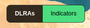

   Selecting an indicator

Click on the indicator panel to display available datasets, such as land degradation indicators or productivity layers.
Indicators can be combined or compared visually on the map.

`Back to top <#geoportal-user-guide>`_

---

.. _choose_area_of_interest:

Choose an Area of Interest
==========================

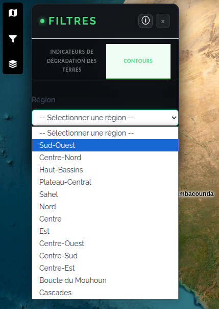

   Defining the area of interest

You can select a specific region or administrative boundary to focus the analysis.
This helps restrict calculations and visualization to your study area.
It is also possible to draw a custom polygon directly on the map.

`Back to top <#geoportal-user-guide>`_

---

.. _apply_filters:

Apply Filters
=============

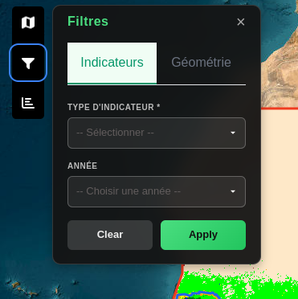

   Applying filters

Use the filter panel to refine your data selection (e.g., time period, indicator type, or data source).
Use filters to compare the baseline period (2000–2015) and the reporting period (2015–2022).

`Back to top <#geoportal-user-guide>`_

---

.. _national-geoportal-interface:

National Geoportal Interface
============================

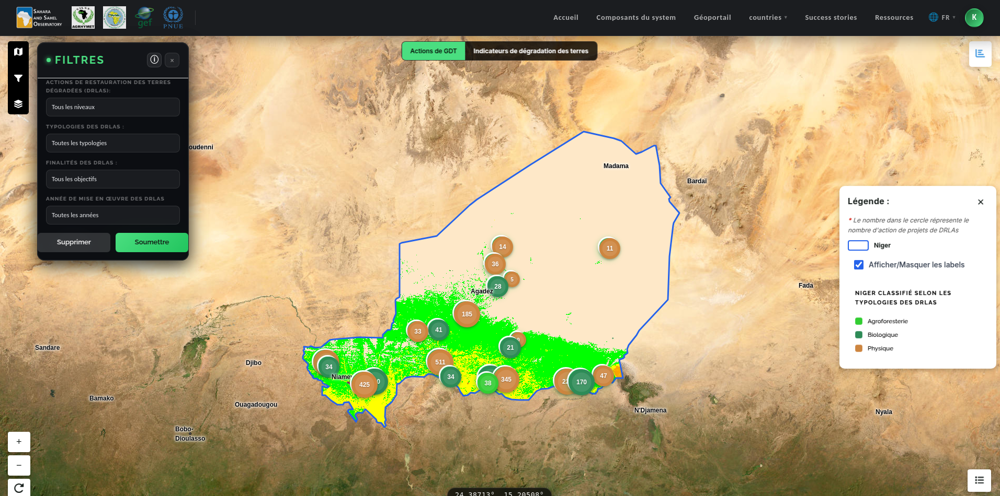

   Geoportal interface for Niger

`Back to top <#geoportal-user-guide>`_

---

.. _national-platform:

National Platform
=================

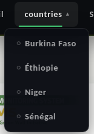

   Menus available on the national platform

The platform provides a country-specific view accessible from the main menu.
Each country (Burkina Faso, Ethiopia, Niger, Senegal) has its own interface with preloaded national data.

`Back to top <#geoportal-user-guide>`_

---

.. _display-customization:

Display Customization
=====================

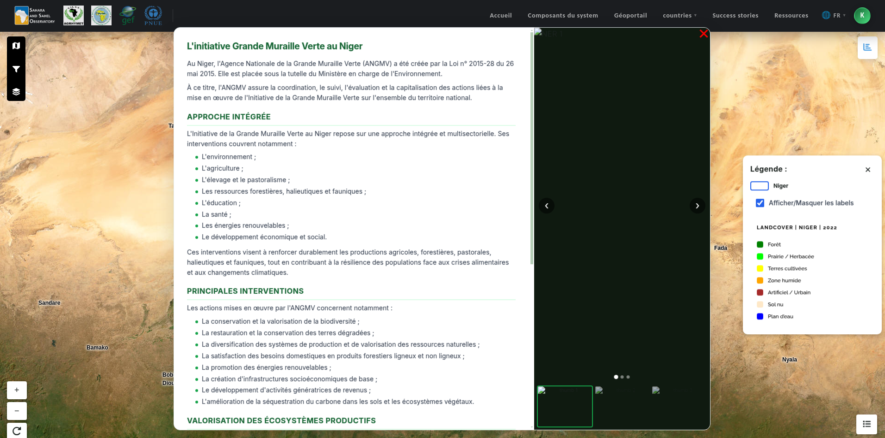

   Display customization options (Niger)

The customization toolbar allows you to adjust layer transparency, show or hide map elements,
and configure the display of labels and administrative boundaries.

`Back to top <#geoportal-user-guide>`_

---

.. _filter-by-country:

Filter by Country
=================

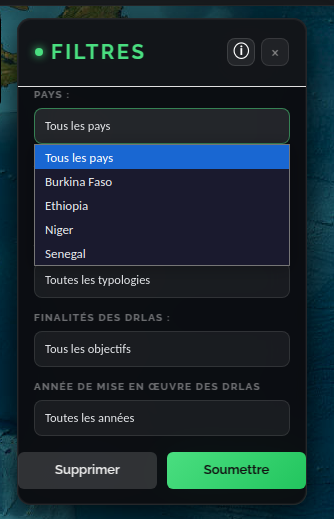

   Country selection filter

The country filter loads the data layers corresponding to the selected country.
Once a country is selected, available indicators are updated automatically.

`Back to top <#geoportal-user-guide>`_

---

.. _gdt-actions:

GDT Actions and Land Degradation
================================

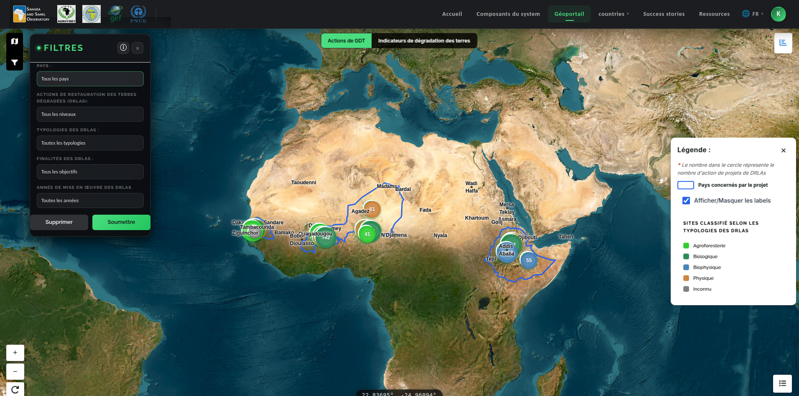

   Sustainable land management action buttons

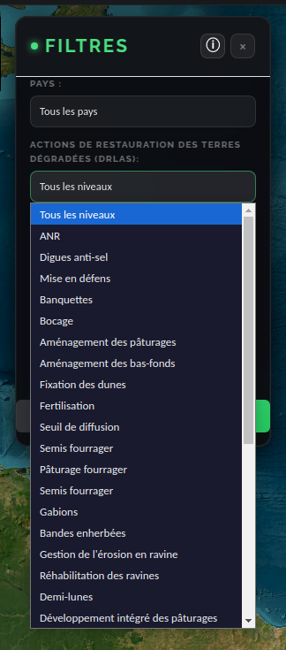

   Selecting a land degradation action

The GDT action buttons allow you to browse and filter restoration interventions by practice type
(agroforestry, reforestation, water management, etc.).
The degradation selector identifies the main drivers of land degradation by area.

`Back to top <#geoportal-user-guide>`_