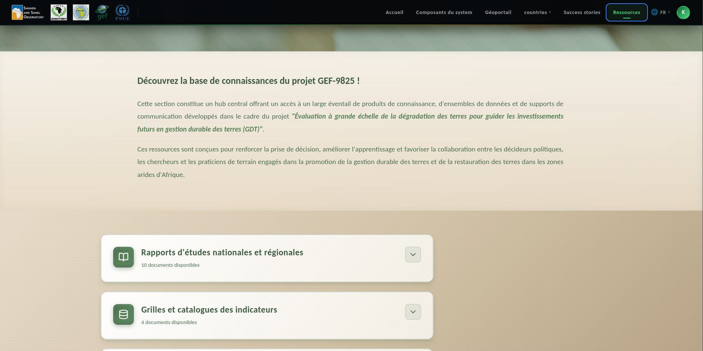

.. _resources:

Resources
=========

The **Resources** page centralizes all publications, reports, and technical guides
available for download.

.. contents::
   :local:
   :depth: 2

---

.. _resources-overview:

Overview
--------

   Resources and documentation page

Users can access:

* Methodological documentation for SDG 15.3.1 indicators
* Platform user guides
* Scientific articles and technical reports
* UNCCD reporting templates

`Back to top <#resources>`_
