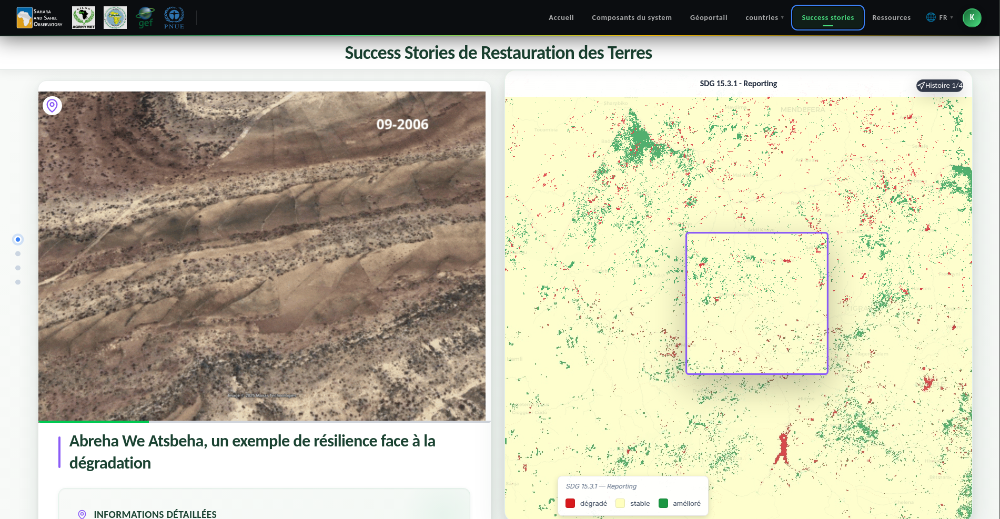
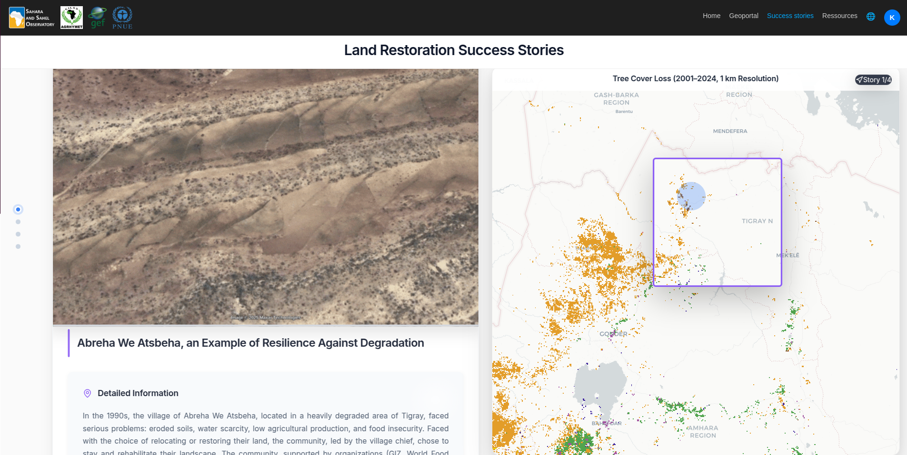

.. _success-stories:

Success Stories
===============

The **Success Stories** page presents an interactive map of project sites.
It allows users to visualize restoration interventions geographically and to access
detailed information for each site.

.. contents::
   :local:
   :depth: 2

---

.. _success-stories-overview:

Overview
--------

   Success Stories page

The Success Stories map displays all GDT intervention sites across the four target countries
(Burkina Faso, Ethiopia, Niger, Senegal).
Each site marker opens a detail panel showing the key attributes of the intervention.

`Back to top <#success-stories>`_

---

.. _success-stories-map:

Interactive Map
---------------

   Interactive map of GDT project sites

The interactive map allows you to:

* Browse all project sites across the Great Green Wall countries
* Click on a site marker to view its details (country, region, typology, treated area, funding)
* Filter sites by country, typology, or intervention type
* Export the filtered site list

`Back to top <#success-stories>`_
